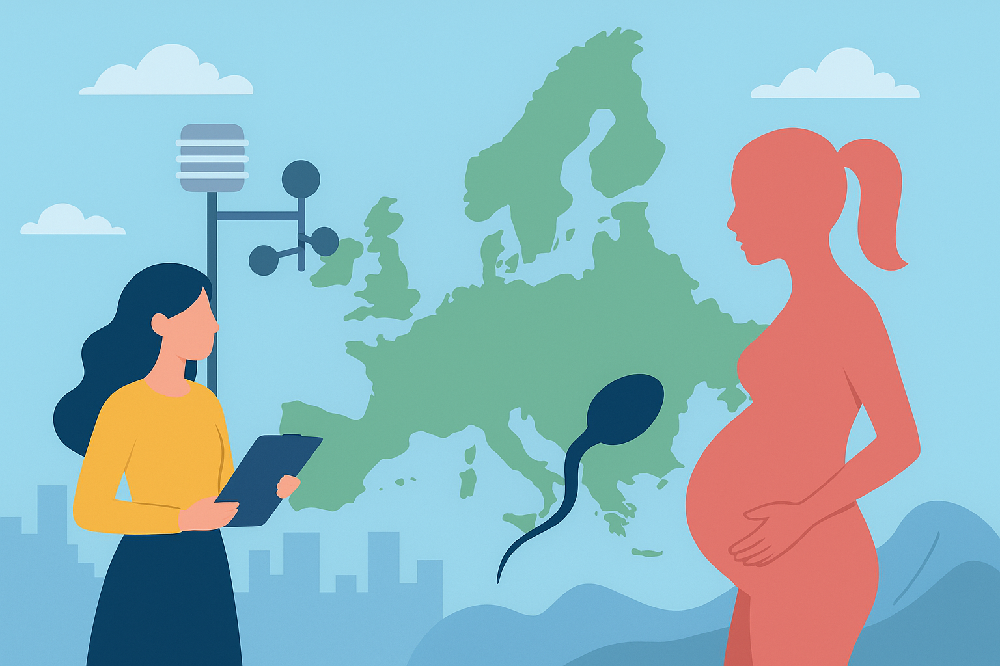

**Autores:** Daniel Marina de la Cal, Nerea Yi Estepar Calvo y Patricia
Ibarrondo Revilla

# Impacto de la vigilancia del aire sobre la fertilidad en la población europea

En este seminario analizamos si existe alguna relación entre la  
**vigilancia y la calidad del aire** y la **fertilidad media (TFR)** en
los países europeos, combinando distintas bases de datos de calidad del
aire (EEA, OMS, emisiones de CO₂) con estadísticas de fertilidad de
Eurostat.

El enfoque es **ecológico y descriptivo**, con la unidad de análisis en
el nivel **país**.

## Objetivos

Explorar hasta qué punto la vigilancia y la contaminación atmosférica
pueden estar asociadas con los niveles medios de fertilidad, a través de:

- Analizar la intensidad de la **vigilancia de la calidad del aire**
  (número de observaciones reportadas y densidad de estaciones) por país.
- Estudiar la relación entre la **vigilancia del aire** y la
  **fertilidad media (TFR)**.
- Analizar si los niveles medios de **NO₂** por país se asocian con la
  TFR.
- Evaluar si las **emisiones de CO₂** se relacionan con la fertilidad.
- Analizar el peso relativo del **PM₂.₅** dentro de la vigilancia del
  aire y su relación con la fertilidad.

## Resultados

### Relación entre la vigilancia del aire y la fertilidad

Los análisis descriptivos y los modelos de regresión lineal (con errores
estándar robustos) muestran que **no existe una asociación clara ni
estadísticamente significativa** entre el volumen total de observaciones
de calidad del aire —normalizado por población— y la fertilidad media
por país. Los países que vigilan más no presentan, de forma sistemática,
una TFR más alta ni más baja que los que vigilan menos.

### Relación entre NO₂ y fertilidad

El gráfico que relaciona el **NO₂ medio** con la TFR muestra una nube de
puntos muy dispersa y una recta de regresión con pendiente prácticamente
nula. El coeficiente de correlación de Pearson es cercano a cero y no
significativo. En consecuencia, **no se observa un patrón sistemático**
que indique que los países más contaminados por NO₂ tengan menor (o
mayor) fertilidad.

### Relación entre CO₂ y fertilidad

El ranking de **emisiones medias de CO₂** y los diagramas de dispersión,
tanto agregados como por año, indican que los grandes emisores no se
diferencian claramente del resto en términos de TFR. Las pendientes de
las rectas de regresión son muy pequeñas y los valores de R² bajos, de
modo que **las emisiones de CO₂ explican una fracción mínima de la
variación en fertilidad** entre países europeos. La correlación de
Pearson entre CO₂ medio y TFR es cercana a cero y no significativa.

### Relación entre el peso del PM₂.₅ y la fertilidad

El análisis del **peso relativo del PM₂.₅** en la vigilancia (proporción
de observaciones dedicadas a este contaminante) muestra valores
generalmente bajos y heterogéneos entre países. Aunque algunos países
asignan una mayor proporción de su vigilancia al PM₂.₅, **no presentan
niveles de fertilidad claramente diferenciados** de los que lo
monitorizan menos.  

La regresión lineal robusta sugiere una pendiente ligeramente positiva,
pero el efecto es **estadísticamente no significativo**, por lo que no
puede descartarse que la asociación observada se deba al azar.

## Conclusiones

Los resultados apuntan a una **gran variabilidad y ausencia de patrones
simples** en la relación entre vigilancia del aire, contaminación
atmosférica (NO₂, CO₂, PM₂.₅) y fertilidad a nivel país. En este marco
ecológico, estos factores ambientales se comportan como **posibles
riesgos indirectos** insertos en un entramado mucho más amplio de
determinantes demográficos, socioeconómicos e institucionales, pero **no
aparecen como causas directas ni únicas** de las diferencias de
fertilidad entre países europeos.

Dado que se trata de un estudio **ecológico y descriptivo**, basado en
indicadores agregados y sin control detallado por otros factores de
confusión (renta, estructura por edades, urbanización, políticas
familiares, mercado laboral, etc.), las conclusiones deben
interpretarse con cautela.  

El trabajo funciona como un **punto de partida exploratorio** que señala
la necesidad de estudios con **mayor resolución espacial, datos
individuales y diseños longitudinales o cuasi experimentales**, que
permitan evaluar con más precisión cómo la calidad del aire puede
influir en la salud reproductiva y, en última instancia, en los niveles
de fertilidad observados.
